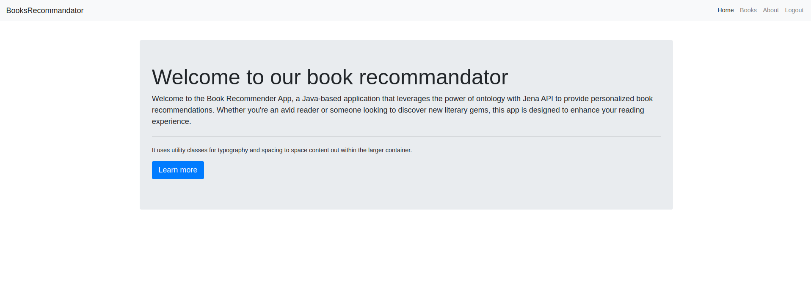

# Book Recommender App Readme

# 📚

## Overview



Welcome to the Book Recommender App, a Java-based application that leverages the power of ontology with Jena API to provide personalized book recommendations. Whether you're an avid reader or someone looking to discover new literary gems, this app is designed to enhance your reading experience.

## Features

- **Ontology-driven Recommendations:** Our app utilizes ontology to create a rich semantic network of books, genres, and user preferences. This ensures intelligent and personalized book recommendations.

- **Jena API Integration:** We have seamlessly integrated the Jena API to efficiently manage and query our ontology. This powerful combination allows for dynamic and sophisticated recommendation algorithms.

- **User-Friendly Interface:** The app boasts a sleek and intuitive user interface, making it easy for users to explore, rate, and discover books. Your reading journey is just a click away.

- **Iconic Design:** Our app comes with a visually appealing design, featuring custom icons that add a touch of elegance to your reading experience.

## How to Use Back End Application with spring

1. **Clone the Repository:**

   ```bash
   git clone https://github.com/Ayoubkassi/BookRecommandator.git
   ```


2. **Run the App:**

   ```bash
   java -jar bookrecommander-0.0.1-SNAPSHOT.jar
   ```

3. **Explore and Enjoy:**
   Open your web browser and navigate to `http://localhost:5000` to start exploring personalized book recommendations.


## How to Use Front Client Side

**Install Dependencies**
> cd client && npm install

or if you use yarn u can install and build with it

**Run client app**

> npm start


**You can run only back end part and use http client like Postman or Insomnia to process ur http request without client app**


## Dependencies

- Java 8
- Apache Ant
- Jena API

## Contribution Guidelines

We welcome contributions to make our Book Recommender App even more awesome! If you have ideas for new features, improvements, or bug fixes, please follow our [contribution guidelines](CONTRIBUTING.md).

## Feedback

We value your feedback! If you encounter any issues, have suggestions, or just want to share your love for the app, please open an [issue](https://github.com/Ayoubkassi/BookRecommandator/issues).

## Credits

This app is brought to you by the amazing contributors at [Your Organization/Username](https://github.com/ayoubkassi). Special thanks to the creators of Jena API for their fantastic work.

Happy reading! 📚✨
